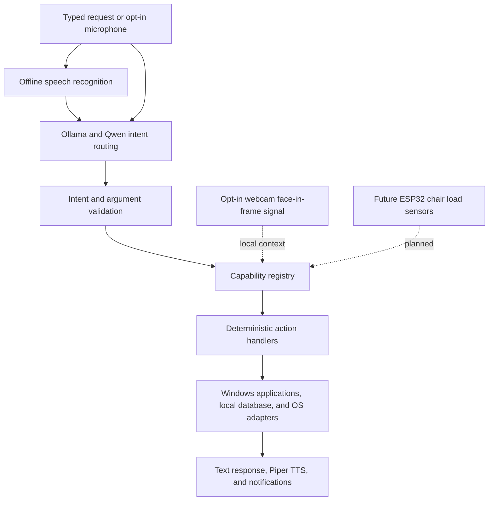

# A.U.R.A.

**Adaptive User-Centric Responsive Assistant (A.U.R.A.)** is a multidisciplinary project to build a local-first Windows assistant that can hear spoken requests, carry out a controlled set of actions, and adapt to the user's context. The laptop provides its microphone, speakers, webcam, and local compute. A later hardware phase will connect an ESP32 to load sensors in a chair to estimate whether the user is seated.

The language model interprets requests and selects from registered functions. It does not receive unrestricted access to the operating system. Deterministic Python handlers validate arguments and perform the actual actions. Voice and webcam sensing are explicitly opt-in: both start off and remain off until enabled in A.U.R.A.'s window or tray menu.

## Project status

The repository contains a Python action layer and an early Windows desktop/system-tray application. The desktop build includes offline microphone recognition through faster-whisper, neural speech output through Piper, and on-device webcam face-in-frame detection. ESP32/load-sensor integration and a packaged installer remain future work. The desktop interface is an active prototype rather than a finished consumer installer.

Speech recognition uses faster-whisper's `small.en` model on the CPU with int8 inference. On first microphone use, the model (roughly 460 MB) is downloaded into `%LOCALAPPDATA%\AURA\models`; audio is then transcribed locally. Pause-based capture and VAD help segment utterances. Piper generates speech locally using the `en_US-lessac-medium` neural voice, downloaded on first spoken response (roughly 64 MB) into `%LOCALAPPDATA%\AURA\voices`. Use **Test voice** in the window to check playback. Webcam processing checks frames locally for a face; frames are not saved or sent to a service. When webcam sensing is enabled, the limited face-in-frame signal may accompany a request as context. A face in frame is only a visual signal, not identity or proof that the user is seated.

Natural-language intent routing uses Ollama with a local Qwen model. The model emits a structured intent and arguments, which are validated before a registered Python handler runs. It cannot return executable commands.

## Current capabilities

- Registry-based actions with argument validation and confirmation for sensitive operations.
- Application discovery and launch through an allowlisted application catalog.
- SQLite-backed reminders and scheduled application launches.
- In-memory timers and Pomodoro sessions.
- Local Ollama intent routing, capability listing and explanations, and workflows.
- Opt-in faster-whisper speech recognition and Piper neural speech output.
- Opt-in local webcam face-in-frame context, without frame storage.
- A Windows desktop window, recent activity view, local service status, and system-tray lifecycle. Closing the window keeps A.U.R.A. running; use **Exit A.U.R.A.** to stop it.

The ESP32 and chair load sensors are not connected yet. The current visual signal does not replace those planned sensors.

## Architecture



## Run the prototype

Requirements: Windows, Python 3.11 or later, and Ollama with a local Qwen model available.

From the repository folder:

```powershell
py -m venv .venv
.\.venv\Scripts\Activate.ps1
py -m pip install -e ".[desktop]"
Copy-Item .env.example .env
py -m aura --desktop
```

Start Ollama through its normal Windows application or service before launching A.U.R.A. The example configuration uses `qwen3:4b`; change `AURA_OLLAMA_MODEL` in `.env` if you have a different model installed.

The desktop interface is an early development build, not an installer. It starts with its window open; closing the window hides it to the system tray, where **Exit A.U.R.A.** fully stops the app. The microphone and webcam are off on startup. Use their enable controls in the window or tray menu when you want them active. First use downloads the faster-whisper `small.en` model and Piper voice; an internet connection is needed for initial setup. Recognition and speech generation are local after setup. Use **Test voice** to check the speaker and voice model.

To start A.U.R.A. without opening a terminal, double-click `Start AURA.vbs` in the project folder. It launches the desktop interface using the project's virtual environment.

The `desktop` extra installs faster-whisper, Piper, microphone playback/capture, webcam, and desktop dependencies. PyAudio is not used. To run the console with speech input and output, use `py -m aura --voice` after installing the desktop extra. The camera is only available in the desktop interface. Set `AURA_WHISPER_MODEL` in `.env` to select another faster-whisper model; the default `small.en` balances recognition quality and local speed for English.

Use `py -m aura --list-actions` to list the registered capabilities. Set `AURA_DEBUG=1` in `.env` to enable diagnostic logging. By default, the SQLite database is stored under `%LOCALAPPDATA%\AURA\aura.sqlite3`.

## Example requests

- “Open Chrome.”
- “Open Chrome in 10 seconds.”
- “Open VS Code at 6 PM.”
- “Remind me tomorrow at 9 AM to attend class.”
- “Start a Pomodoro.”
- “List available functions.”
- “Explain the schedule_open_app function.”
- “Toggle Spotify.”

The app catalog and natural-language routing are not a guarantee that every installed app or phrasing will be recognized. Spotify controls use the Windows media key and may be handled by another active media player.

## Scheduling and persistence

Reminders and application schedules are stored in SQLite. Their background workers run only while A.U.R.A. is running. Scheduled app launches also require the computer to be awake at the scheduled time; overdue schedules are checked when A.U.R.A. starts again. Timers and Pomodoro sessions are in memory and are lost when the process exits.

The desktop shell currently stays in the system tray when its window is closed. Future milestones include ESP32 chair sensor integration, optional Windows startup, first-run dependency setup, editable settings, and a packaged installer. Schedule behavior across sleep, shutdown, and Windows sign-in still needs a durable lifecycle design.

## Safety model

- The model can choose only registered capabilities and provide structured arguments.
- The router and registry validate model output before an action runs.
- Action handlers do not accept model-generated shell commands or arbitrary executable paths.
- Sensitive system actions require explicit confirmation.
- File access is restricted to known user folders or explicitly registered roots; no delete action is provided.
- Reminders and schedules are managed through the local SQLite database.
- Microphone and camera sensing start off and require an explicit user action to enable.

## Development

Install the test dependencies with `py -m pip install -e ".[test]"`, then run `py -m pytest`. Tests use temporary databases and mock operating-system effects; they do not launch installed applications or shut down the computer.

Actions are defined in `aura/actions/builtin.py` and implemented in `aura/actions/handlers.py`. Application entries are maintained in `aura/apps/catalog.py`. Workflows refer to registered actions and fixed arguments; user or model text is not evaluated as workflow code.
