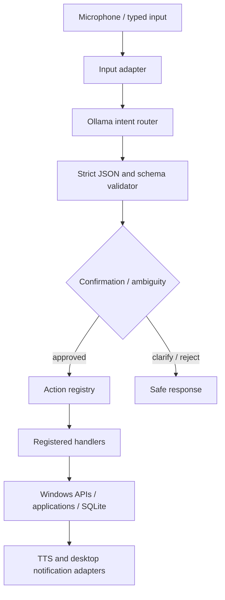

# AURA Desktop Assistant

AURA is a local-first Windows assistant starter project. Its action layer is deterministic and allowlisted: Ollama can select a registered action and supply typed arguments, while Python code validates and executes it. The model never receives a shell or arbitrary-code execution tool.

## Architecture



## Quick start

Requires Python 3.11+. From this folder:

```powershell
py -m venv .venv
.\.venv\Scripts\Activate.ps1
py -m pip install -e ".[test]"
Copy-Item .env.example .env
py -m aura
```

Ollama must be installed and running locally. For faster intent routing on a laptop iGPU, pull `qwen3:4b` with `ollama pull qwen3:4b` and set `AURA_OLLAMA_MODEL=qwen3:4b` in `.env`. AURA disables Qwen3 thinking for the routing task, caps generated JSON, and keeps the model loaded for 15 minutes by default; adjust `AURA_OLLAMA_KEEP_ALIVE`, `AURA_OLLAMA_NUM_CTX`, and `AURA_OLLAMA_NUM_PREDICT` if needed. `AURA_DEBUG=1` prints Ollama load, prompt-evaluation, and generation timings to show where latency is occurring.

The default console interface works without voice extras. Voice input is optional; installing the `voice` extra may require Microsoft C++ Build Tools to compile PyAudio on some Python versions. To enable microphone input, install a Vosk model locally and set `AURA_VOSK_MODEL_PATH`; AURA does not send microphone audio to a cloud recognition service.

Use `py -m aura --list-actions` to inspect registered capabilities. `AURA_DEBUG=1` enables diagnostic logging. The SQLite database defaults to `%LOCALAPPDATA%\AURA\aura.sqlite3`.

## Built-in spoken commands

- `Remind me tomorrow at 9 AM to attend class.` Reminders persist in SQLite and can recur daily or weekly.
- `List reminders`, `delete reminder 2`, `edit reminder 2`, and `snooze reminder 2 for 10 minutes` manage reminders.
- `Start a Pomodoro.` Defaults to 25-minute focus periods, 5-minute breaks, and 4 cycles. You can specify alternate values or say `cancel Pomodoro`.
- `Open Chrome in 10 seconds` schedules a relative delay measured from when AURA received the request; if model inference takes longer than the delay, AURA opens it as soon as routing finishes. `Open Chrome at 6 PM` schedules a clock time. `Open VS Code every weekday at 9 AM` or `Open Teams every Monday at 10 AM` creates recurring launches. Say `list app schedules` or `cancel app schedule 1` to manage them. Failed launches remain visible in the schedule list.
- `List available functions` (also `what can you do`) prints registered function IDs and descriptions without making an Ollama request. Ask `Explain the schedule_open_app function` for its arguments and an example.
- `Toggle Spotify`, `pause Spotify`, and `resume Spotify` send the Windows play/pause media key. Windows may direct that key to another active media app.
- Greetings such as `hello`, `good morning`, and `hey AURA` receive an immediate local response without model inference.

## Extending AURA

### Add an action

Implement a handler in `aura/actions/handlers.py`, then register metadata with `ActionSpec` in `aura/actions/builtin.py`. Include an argument schema, validation, confirmation setting, concise spoken responses, and examples. Router capabilities are generated at runtime from the registry.

### Add an application

Add an `AppSpec` data entry in `aura/apps/catalog.py` with canonical ID, display name, aliases, and known launch candidates. The generic resolver also searches PATH and Windows Start Menu shortcuts. No application-specific launch function is needed.

### Add a workflow

Add a workflow definition to `aura/workflows/catalog.py`. Steps refer only to existing action IDs and fixed argument objects. User/model text is never evaluated as workflow code.

## Safety and behavior

- Model replies are parsed as one JSON object and validated against the registry-derived action/argument schemas.
- Unknown actions, missing or extra arguments, invalid values, low confidence, and malformed JSON are rejected before handlers run.
- Action handlers never accept model-supplied executable paths or shell commands.
- Shutdown and restart require an explicit follow-up confirmation. Pending confirmation is consumed as confirmation text.
- File opening is restricted to known user folders or explicitly registered roots; no delete action is provided.
- Reminders persist in SQLite and are checked by a background worker. Recurrence supports daily, weekly, and interval rules.
- Timers are in memory and therefore reset when AURA exits.
- Scheduled app launches are saved in SQLite, but AURA must be running and the computer awake at the scheduled time to launch them. AURA checks overdue schedules when it starts again.
- The initial app catalog is broad; entries are optional and missing apps produce a friendly response.
- On this clean-slate starter, OS features are implemented as registered Windows handlers where practical. Voice, presence sensing, and context awareness are optional adapters, not required for safe action execution.

## Testing

Run `py -m pytest`. Tests use temporary databases and mock operating-system effects; they do not launch installed apps or shut down the computer.
