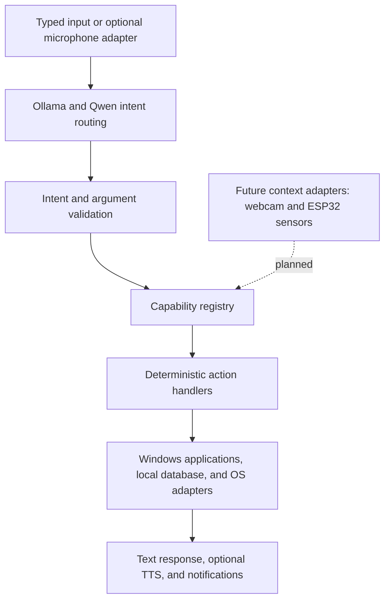

# A.U.R.A.

**Adaptive User Responsive Assistant** is a student multidisciplinary project exploring a local, privacy-focused assistant for Windows. The long-term goal is an assistant that can understand voice requests, perform controlled desktop actions, and use user-presence and environmental context to respond appropriately.

The laptop is A.U.R.A.'s primary device: its microphone and speakers provide voice input and output, its webcam can support future visual context features, and its CPU or GPU can run local AI. External hardware such as an ESP32 and load sensors in a chair is intended to extend the system's awareness of user presence.

## Project status

This repository currently contains the **Python prototype, deterministic action layer, and an early Windows desktop/system-tray interface**. It is not yet the finished desktop assistant: packaged installation, integrated speech setup, webcam processing, and ESP32/load-sensor integration remain future work.

The current prototype uses Ollama with Qwen for natural-language intent routing. The model selects from registered capabilities and supplies structured arguments; Python validates those arguments and calls predefined handlers. The model is not given unrestricted shell or code execution.

## Current capabilities

- Registry-based actions with argument validation and confirmation for sensitive operations.
- Application discovery and launch through an allowlisted application catalog.
- SQLite-backed reminders and scheduled application launches.
- In-memory timers and Pomodoro sessions.
- Local Ollama intent routing, capability listing and explanations, workflows, and optional speech adapters.
- Desktop notifications where supported by the installed environment.
- An early desktop window with local service status, recent activity, typed requests, and a system-tray lifecycle. Closing the window keeps A.U.R.A. running; use **Exit A.U.R.A.** to stop it.

Current limitations are documented below and in the relevant implementation. In particular, the console interface is the only complete user interface today. Optional voice support requires separate dependencies and a locally supplied Vosk model. Presence, webcam context, and ESP32 sensor support are not implemented yet.

## Architecture



## Run the prototype

Requirements: Windows, Python 3.11 or later, and Ollama with a local Qwen model available.

From the repository folder:

```powershell
py -m venv .venv
.\.venv\Scripts\Activate.ps1
py -m pip install -e ".[desktop]"
Copy-Item .env.example .env
py -m aura --desktop
```

Start Ollama through its normal Windows application or service before launching A.U.R.A. The example configuration uses `qwen3:4b`; change `AURA_OLLAMA_MODEL` in `.env` if you have a different model installed. The default console interface does not require the optional voice dependencies.

The desktop interface is an early development build, not an installer. It starts with its window open; closing the window hides it to the system tray, where **Exit A.U.R.A.** fully stops the app. Listening and presence menu items are shown as unavailable until those integrations are implemented. Use `py -m aura` to run the console interface instead.

To enable the optional microphone interface, install the `voice` extra and a Vosk model locally, then set `AURA_VOSK_MODEL_PATH` in `.env`. Microphone audio is processed locally by that adapter.

Use `py -m aura --list-actions` to list the registered capabilities. Set `AURA_DEBUG=1` in `.env` to enable diagnostic logging. By default, the SQLite database is stored under `%LOCALAPPDATA%\AURA\aura.sqlite3`.

## Example requests

- “Open Chrome.”
- “Open Chrome in 10 seconds.”
- “Open VS Code at 6 PM.”
- “Remind me tomorrow at 9 AM to attend class.”
- “Start a Pomodoro.”
- “List available functions.”
- “Explain the schedule_open_app function.”
- “Toggle Spotify.”

The app catalog and natural-language routing are not a guarantee that every installed app or phrasing will be recognized. Spotify controls use the Windows media key and may be handled by another active media player.

## Scheduling and persistence

Reminders and application schedules are stored in SQLite. Their background workers run only while A.U.R.A. is running. Scheduled app launches also require the computer to be awake at the scheduled time; overdue schedules are checked when A.U.R.A. starts again. Timers and Pomodoro sessions are in memory and are lost when the process exits.

The desktop shell currently stays in the system tray when its window is closed. Future milestones include optional Windows startup, first-run dependency setup, editable settings, and a packaged installer. Schedule behavior across sleep, shutdown, and Windows sign-in still needs a durable lifecycle design.

## Safety model

- The model can choose only registered capabilities and provide structured arguments.
- The router and registry validate model output before an action runs.
- Action handlers do not accept model-generated shell commands or arbitrary executable paths.
- Sensitive system actions require explicit confirmation.
- File access is restricted to known user folders or explicitly registered roots; no delete action is provided.
- Reminders and schedules are managed through the local SQLite database.

## Development

Install the test dependencies with `py -m pip install -e ".[test]"`, then run `py -m pytest`. Tests use temporary databases and mock operating-system effects; they do not launch installed applications or shut down the computer.

Actions are defined in `aura/actions/builtin.py` and implemented in `aura/actions/handlers.py`. Application entries are maintained in `aura/apps/catalog.py`. Workflows refer to registered actions and fixed arguments; user or model text is not evaluated as workflow code.
